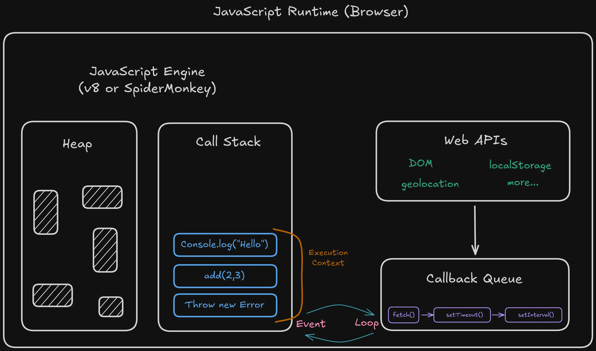
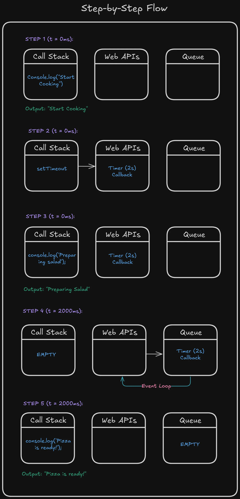

Sometimes I wonder why JavaScript can handle so many things at once without breaking a sweat. Have you ever stopped to think about how your browser manages to fetch data, animate elements, and respond to clicks, all at the same time?

The answer lies in something beautifully elegant: the Event Loop.

## The Single-Threaded Illusion

Here's the thing: JavaScript is single-threaded. That means it can only do one thing at a time. Think of it like a chef working alone in a kitchen, they can't chop vegetables and stir soup simultaneously. Yet somehow, our JavaScript applications feel incredibly responsive.

How? Let's peek under the hood.

## The JavaScript Engine: More Than Just Code Execution

When you're writing JavaScript, you're actually working with several moving parts. The engine itself (V8 in Chrome, SpiderMonkey in Firefox) has two main components:

- **The Call Stack**: Where your code gets executed, one function at a time
- **The Heap**: Where objects live in memory

But the magic happens when we add the browser's Web APIs and the Event Loop into the mix.

## A Kitchen Analogy

Imagine our chef (the Call Stack) cooking in a restaurant. They can only prepare one dish at a time, but they have help:

- **Prep cooks (Web APIs)**: Handle time-consuming tasks like baking or marinating outside the main kitchen.
- **The expeditor (Event Loop)**: Checks if dishes are ready and brings them back to the chef.
- **The pass (Callback Queue)**: Where completed dishes wait before being plated.



This is exactly how JavaScript works.

## The Event Loop in Action

Let's see this with code:

```jsx
console.log("Start cooking");

setTimeout(() => {
  console.log("Pizza is ready!");
}, 2000);

console.log("Preparing salad");
```

What happens here?

1. "Start cooking" logs immediately (Call Stack)
2. `setTimeout` is handed off to the Web API (like our prep cook)
3. "Preparing salad" logs immediately (Call Stack is free)
4. After 2 seconds, the callback moves to the Callback Queue
5. The Event Loop sees the Call Stack is empty and pushes the callback
6. "Pizza is ready!" finally logs

The Event Loop is constantly asking: "Is the Call Stack empty? Anything in the queue?" It's the coordinator that never sleeps.



## Microtasks vs Macrotasks

Here's where it gets interesting. Not all tasks are equal. You're actually dealing with two queues:

- **Microtask Queue**: Promises, queueMicrotask
- **Macrotask Queue**: setTimeout, setInterval, I/O operations

Microtasks always cut in line. They get priority.

```jsx
console.log("First");

setTimeout(() => console.log("Timeout"), 0);

Promise.resolve().then(() => console.log("Promise"));

console.log("Last");

// Output:
// First
// Last
// Promise
// Timeout
```

Even though `setTimeout` has zero delay, the promise executes first. The Event Loop processes all microtasks before moving to the next macrotask.

## Why This Matters

Understanding the Event Loop isn't just theoretical knowledge, it transforms how you write code. You'll know why:

- Long-running synchronous code blocks your entire application
- Promises resolve before setTimeout callbacks
- UI updates happen between Event Loop cycles
- `async/await` is just syntactic sugar over this mechanism

## The Evolution of Understanding

When I first learned JavaScript, I thought `async` meant "runs in the background." That's not quite right. Asynchronous operations are delegated to Web APIs, but your JavaScript code still runs one operation at a time.

The Event Loop is what creates the illusion of parallelism.

## Practical Takeaway

Next time you write asynchronous code, visualize that kitchen. Your function isn't "waiting", it's been delegated. The Call Stack is free to do other work. And the Event Loop? It's the tireless coordinator making sure everything comes together at the right moment.

That's the beauty of JavaScript's concurrency model. Simple, elegant, and surprisingly powerful.

_The Event Loop isn't just a technical detail, it's the heartbeat of every JavaScript application you'll ever write._
