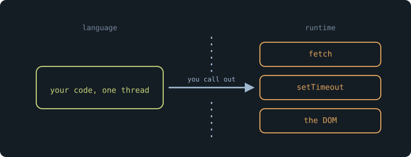
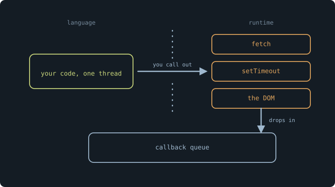
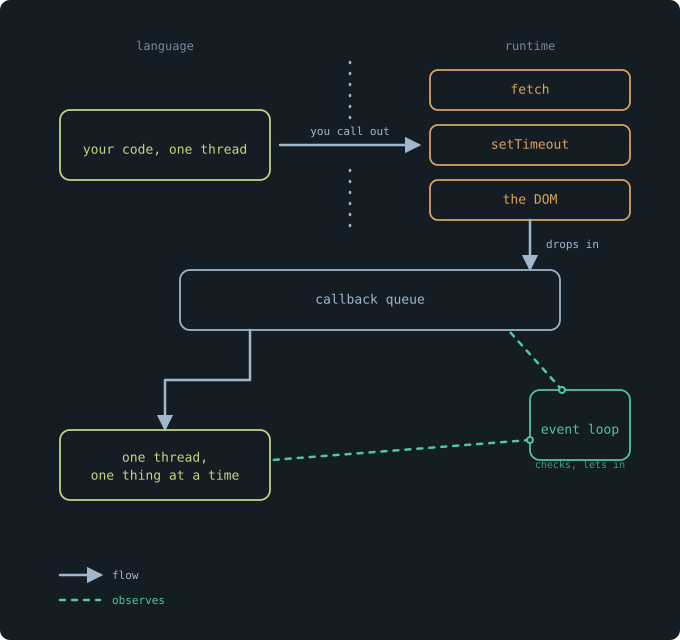
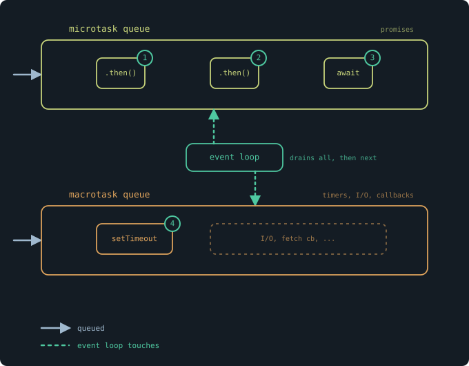

Here's a program. Read it and predict the output before running it.

```js
console.log("first");

Promise.resolve().then(() => {
  console.log("second");
});

console.log("third");
```

If you guessed `first`, `second`, `third`, you read the code the way it's written: top to bottom. But that's not what runs. The output is `first`, `third`, `second`.

The line you wrote second ran last. Nothing here is broken. This is JavaScript doing exactly what it's designed to do. The question is _what_ it's designed to do, because it clearly isn't "run each line in order."

Now add an `await`:

```js
async function load() {
  console.log("start");
  await fetchUser();
  console.log("done");
}
```

The `await` doesn't just pause `load`. It hands control back, lets other code run, and picks up where it left off when `fetchUser` resolves. A single thread walked away from an unfinished function, did other work, and came back to finish it.

And that's the part that should bother you. JavaScript is single-threaded. One thread does one thing at a time. Yet this one thread starts a function, leaves, runs something else, and returns. Your browser downloads three images, responds to your clicks, and runs an animation, all while this code waits.

So one of two things is true. Either JavaScript isn't really single-threaded, or "one thing at a time" doesn't mean what you think it means.

It's the second one. And to see why, you have to separate two words most developers use as if they were the same: _concurrency_ and _parallelism_.

The thread never does two things at the same instant. Look at the `await` again: it runs `load`, steps away, runs something else, comes back. At no point are two lines of your code executing at once. There is always exactly one thing happening.

But across time, two things are _in progress_. `load` hasn't finished, yet other work moves forward while it waits. One task at any instant, many tasks in flight.

That gap has two names. Handling several tasks by interleaving them on one worker is **concurrency**. Running several tasks at the literal same instant, on separate workers, is **parallelism**. JavaScript gives you the first and never the second.

A single cashier makes it concrete. One cashier, two lines. He starts ringing up a customer in line A, and while they dig for their card, he turns and scans an item for line B, then turns back. Both lines move. One worker, alternating. That's concurrency. Parallelism is a second register opening: two cashiers, two customers, the same second. That needs a resource JavaScript doesn't have, a second thread running your code.

Here's what that buys you. With one cashier, no two hands ever reach into the same register at once. Nothing is half-updated by someone else while you're mid-transaction. The single thread is why the state of your JavaScript is predictable, why you never guard a variable against another line of your own code changing it underneath you. Languages with real parallelism pay for it with locks, race conditions, and a whole category of bugs you have simply never had to think about in JavaScript.

The single thread isn't the limitation the event loop works around. It's the design decision the event loop exists to protect.



So who downloads the images?

Not your code. Your code asked for them and moved on. Something else did the actual downloading, on some other thread, while your single thread kept going. The question is what that something is, and where it lives.

Start with `fetch`, since that's what asked for the images. Where is `fetch` defined?

Not in JavaScript. Open the ECMAScript specification, the document that defines the language itself, and search for `fetch`. It isn't there. Neither is `setTimeout`. Neither is `document`, or `localStorage`, or the entire DOM. The language you think you're writing doesn't include the functions you use most.

They come from somewhere else. `fetch` is defined by the browser. `setTimeout` too. On the server, Node provides its own versions. These are the **runtime**: the environment that runs your JavaScript and hands it a set of capabilities the language never had on its own. Your code lives on one side of a line. `fetch`, `setTimeout`, the DOM, all the machinery that touches the network, the clock, the screen, lives on the other.

That line is the whole answer.

When you call `fetch`, you're not running JavaScript that downloads a file. You're calling across the line, asking the runtime to do it. The runtime has resources your thread doesn't: background threads, written in C++, that can sit and wait on a network socket without blocking anything. It starts the download over there and immediately returns control to you. Your thread never waited. It couldn't. It handed the waiting to something built to wait.

This is why the contradiction from the beginning dissolves. Your one thread never downloaded three images at once. It asked the runtime three times, and the runtime, which is not bound by your single thread, did the waiting in parallel. The parallelism exists. It just doesn't exist in your code. It lives on the other side of the line, in machinery that isn't JavaScript at all.

Which leaves one problem. The download finishes over there, on some background thread. Your callback needs to run back here, on your thread, in your code. How does the result get back across the line?



It doesn't come back on its own. That's the part people get wrong.

When the download finishes, the runtime doesn't reach into your thread and run your callback. It can't. Your thread might be in the middle of something, and interrupting it would break the one guarantee that makes JavaScript predictable: that nothing touches your state while a piece of your code is running. The runtime respects the line in both directions. It did the work over there, and now it needs to wait for your thread to be free before your code can continue.

So the finished result goes into a queue. It waits.

Your thread, meanwhile, is running whatever it was running, top to bottom, one thing at a time, exactly as before. When it finishes and has nothing left to do, it's free. Something needs to notice that it's free and pull the next waiting callback off the queue and hand it to the thread.

That something is the event loop.

That's all it is. It's not an engine. It doesn't run your code, the thread does. It doesn't download anything, the runtime does. It doesn't decide what your program means. It does one small, mechanical thing, over and over: check if the thread is free, and if it is, take the next item from the queue and let it run. Check, and let in. Check, and let in. A loop that watches a queue and a thread, and connects them at the only moment it's safe to.

The name oversells it. "Event loop" sounds like the core of the whole system, the engine at the center. It's closer to a doorman. The thread does the work. The runtime does the waiting. The queue holds the results. The event loop just watches the door and lets the next one in when the room is empty.

And this is the model, complete. Your code runs on one thread. When it needs something the language can't do, it calls across the line to the runtime, which does the work on its own threads and drops the result in a queue. The event loop waits for your thread to go idle, then feeds it the next result. One thread, never interrupted, never sharing its state, fed a steady stream of work by a loop whose only job is timing.

Which should raise a question, if you go back to where we started.



Go back to the very first program.

```js
console.log("first");

Promise.resolve().then(() => {
  console.log("second");
});

console.log("third");
```

You know now why `second` waits. The `.then` callback doesn't run inline; it goes into the queue, and the event loop only feeds it to the thread once the current code is done. `first`, `third`, then `second`. The model explains it.

Except the model doesn't explain all of it. Add one line:

```js
console.log("first");

setTimeout(() => console.log("timeout"), 0);

Promise.resolve().then(() => console.log("promise"));

console.log("third");
```

`setTimeout` with a delay of zero. It asks to run as soon as possible, and it asks _before_ the promise does, two lines earlier. Both callbacks are waiting by the time the synchronous code finishes. Both are ready. The thread goes idle. The event loop turns to the queue.

The output is `first`, `third`, `promise`, `timeout`.

The promise wins. It was registered second, it asks for no delay against a timer that also asked for none, and it still runs first. If the event loop simply pulled from one queue in arrival order, this could not happen.

It doesn't pull from one queue. There are two.

Promise callbacks go into one line, usually called the microtask queue. Timers, I/O, the callbacks the runtime hands back from `fetch`, go into another, the macrotask queue. And the event loop does not treat them equally. After each macrotask, before it will touch the next one, it drains the entire microtask queue to empty. Every pending promise callback runs, and any promises _they_ schedule run too, all of it, before a single timer gets its turn.

So the timer never had a chance. `setTimeout(fn, 0)` doesn't mean "run this now." It means "put this in the slow line." The promise was in the fast line all along.



That's the whole reason the order looked wrong at the start. Not because JavaScript is unpredictable. Because it is _precisely_ predictable, along rules that were never visible in the code. The single thread, the line between language and runtime, the queue, the loop, and now two lanes through it with a strict priority between them. None of it is in the source. All of it decides what your source does.

You were never reading the program wrong. You were reading only half of it. The other half is the machine underneath, and it was following its rules exactly, the entire time.
